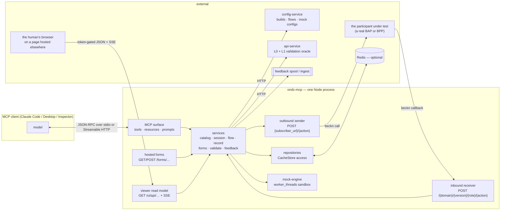
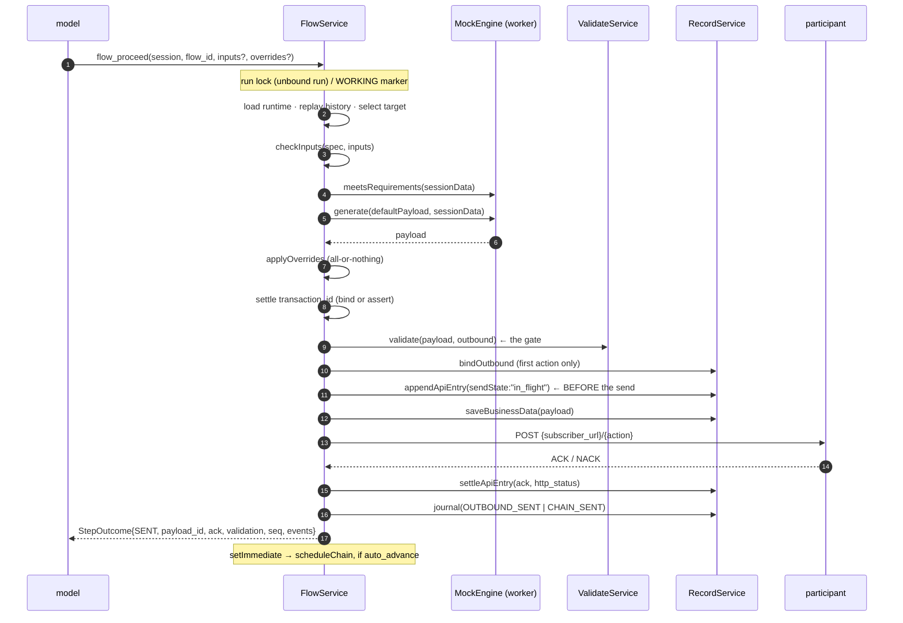

# ARCHITECTURE — ondc-mcp

How this MCP server is put together and how it actually runs, end to end.

This is the **descriptive** document: what exists, how the pieces fit, what
happens on each path. `CLAUDE.md` is the **normative** one — it states the
decisions and the invariants that must not be undone, and it is the file to
change when a decision changes. `README.md` covers the scaffold's conventions
(tool schemas, error channels, stdout discipline, auth, deployment).

---

## Table of contents

1. [What this server is](#1-what-this-server-is)
2. [The shape of the process](#2-the-shape-of-the-process)
3. [Composition and layering](#3-composition-and-layering)
4. [The domain model](#4-the-domain-model)
5. [The catalog: where flows come from](#5-the-catalog-where-flows-come-from)
6. [The flow engine: state is derived, never stored](#6-the-flow-engine-state-is-derived-never-stored)
7. [The outbound path — `flow_proceed`](#7-the-outbound-path--flow_proceed)
8. [The inbound path — the receiver](#8-the-inbound-path--the-receiver)
9. [Waiting, and the session journal](#9-waiting-and-the-session-journal)
10. [Auto-advance chaining](#10-auto-advance-chaining)
11. [Forms](#11-forms)
12. [Validation](#12-validation)
13. [`payload_overrides` — the escape hatch](#13-payload_overrides--the-escape-hatch)
14. [Feedback — the incident corpus](#14-feedback--the-incident-corpus)
15. [`flow_restart` and attempts](#15-flow_restart-and-attempts)
16. [State, concurrency and failure policy](#16-state-concurrency-and-failure-policy)
17. [Surface reference: tools, resources, prompts, routes](#17-surface-reference-tools-resources-prompts-routes)
18. [Configuration](#18-configuration)
19. [Testing strategy](#19-testing-strategy)
20. [Not built yet](#20-not-built-yet)
21. [File map](#21-file-map)

---

## 1. What this server is

An MCP server that lets an **LLM act as a mock ONDC network participant** — a
mock buyer (BAP) or a mock seller (BPP) — drive one full transaction flow
against a real participant under test, and then say how protocol-compliant that
participant was.

The ONDC Protocol Workbench (`../automation-framework/`) already does this with
compiled Go plugins, a Redis-backed flow engine, and per-step base64 JavaScript
run in a VM sandbox. **This server does not wrap those services.** It
re-implements the protocol runtime natively and exposes it as MCP tools, so the
part the workbench solves with sandboxed JS — _what payload comes next, and is
the one I got acceptable_ — can be solved by a model instead.

What it does consume from the workbench: **flow definitions and mock-runner
configs** from the config-service, executed through
`@ondc/automation-mock-runner` — the same assets, the same sandbox. That is what
makes this a faithful mock rather than an approximation.

### The division of labour

This is the whole idea. Everything in the codebase follows from which column a
responsibility falls into.

| Deterministic — code, always                      | Model — via tools                                      |
| ------------------------------------------------- | ------------------------------------------------------ |
| Generating the payload (the flow's own`generate`) | Deciding**when** a step goes                           |
| Auth header sign + verify_(seam only today)_      | Filling the inputs a step declares                     |
| L0 JSON-schema validation                         | Choosing which unsolicited/extra action to fire        |
| L1 contextual rule validation                     | L2 business/semantic judgement on inbound_(not built)_ |
| Sequence matching + ACK/NACK                      | Filling a counterparty's form                          |
| Recording payloads + business data                | Narrating a compliance report_(not built)_             |
| Computing the report_(not built)_                 | Narrating an incident report                           |

The model's job is **inputs and judgement, not JSON.** It decides when a step
goes, supplies the values the flow declares, and reads what comes back. The
payload itself is produced by the flow's own published code, because that is the
code the network is calibrated against and it cannot drift from the spec the way
a model's draft can.

### Three decisions that fix the shape of the system

| Decision               | Choice                                                                                                                                                                                                                                |
| ---------------------- | ------------------------------------------------------------------------------------------------------------------------------------------------------------------------------------------------------------------------------------- |
| **Spec source**        | The**live config-service**. `CONFIG_SERVICE_URL` is the single source of builds, flows and mock configs; responses are cached in-process. Nothing is bundled — if it is unreachable, sessions cannot be created and `/ready` says so. |
| **Wire ownership**     | **Full NP.** The Fastify app hosts real receiver routes (resolve → validate → ACK/NACK) and signs and POSTs real outbound calls. It replaces api-service + ONIX for the mock side.                                                    |
| **ACK/NACK authority** | **Deterministic**, with an LLM override hook planned (`nack_rules`). No model round trip inside the ACK window.                                                                                                                       |

---

## 2. The shape of the process



Note where the browser sits: it reaches **this** process directly. The page it
runs is served by somebody else, but no payload ever passes through them.

### Two transports, one server definition

Both are built from the same factory (`src/mcp/server.ts#createServerFactory`),
so every capability works identically on either.

- **stdio** (`src/entrypoints/stdio.ts`) — the local client launches the process
  and speaks JSON-RPC on stdin/stdout. One server instance is pinned for the
  connection's lifetime; a stdio connection _is_ a session. `guardStdout()` runs
  before anything else is imported, rebinding `console` onto stderr — the
  mock-runner writes `console.log` under `NODE_ENV=development`, and one stray
  byte on stdout breaks the protocol.
- **Streamable HTTP** (`src/entrypoints/http.ts` → `src/app.ts` →
  `src/plugins/mcp.ts`) — `POST/GET/DELETE /mcp`. `createMcpHandler` builds a
  **new server instance per request**: no session map, no sticky routing, so N
  replicas behind a round-robin balancer all work. This is why
  `buildMcpServer` must stay cheap and everything expensive lives in the
  container.

### Four HTTP surfaces, deliberately different

| Surface      | Path                                           | Auth                                                                                       | Called by                                       |
| ------------ | ---------------------------------------------- | ------------------------------------------------------------------------------------------ | ----------------------------------------------- |
| MCP          | `/mcp`                                         | `AUTH_MODE` (JWT in production, refused as `none`) + DNS-rebinding host/origin checks      | the model's client                              |
| Receiver     | `/{domain}/{version}/{buyer\|seller}/{action}` | **none** — authenticity is the ONDC signature (`verifyAuth` seam), not an MCP bearer token | the third-party participant                     |
| Hosted forms | `/forms/{domain}/{formId}[/submit]`            | **none**                                                                                   | a human following a link out of a beckn payload |
| Viewer       | `/ui/api/…`                                    | its own constant-time bearer token, plus CORS for the page's origin                        | a browser, on a page hosted somewhere else      |
| Health       | `/health`, `/ready`                            | none                                                                                       | a load balancer                                 |

The viewer is the only one of these reached by a browser, and every difference
follows from that: it is the only surface with CORS, the only one that answers a
Private Network Access preflight, and the only one that translates `AppError`
into an HTTP status — the others either answer through the MCP tool channel or
speak beckn's own ACK/NACK. `app.authenticate` is the wrong tool for it for the
same reason it is wrong for `/metrics`: it answers with an RFC 9728 discovery
pointer, and a `fetch` cannot follow one.

### The viewer: the page is hosted, the data is not

A human driving this server through a model sees only what the model narrates.
The viewer is the other channel: `session_create` returns a `viewer_url`, the
prompt tells the model to hand it over, and opening it shows the session's
flows, each step's state, both directions' payloads, the business data and the
journal, live.

The page itself lives in `ONDC-Official/automation-frontend` (`main-tech`, route
`/mcp-session`) — **this repo grows no frontend**. That is what keeps the change
small: no bundler, no `@fastify/static`, no Dockerfile change, and helmet's
app-wide `default-src 'none'` stays honest because nothing here serves HTML. It
works because `flow/engine/` is a port of the very mapper that page's step
renderer was written against, so `FlowService.flowView` can hand over the
`FlowMap` that `status()` would otherwise project away, and the existing
components consume it unchanged.

Four consequences worth keeping:

- **The browser fetches straight from this process.** Payload bodies never pass
  through whoever hosts the page. It also decides who can open a link: an engine
  on a laptop yields one only that person can open; an engine on a public URL
  yields one anybody holding it can.
- **The link's parameters ride in the `#` fragment.** A query string is sent to
  the page's host in the request line, so the token — a credential for *this*
  server — would land in somebody else's access logs.
- **Reads are cursor-neutral.** `readEvents`, never `drainEvents`: that cursor is
  how the model is told what happened, and a viewer that consumed it would leave
  the model deaf while a human watched the callbacks arrive.
- **It is invisible to the model** — no tool, no resource, no line in
  `capabilities.ts`, exactly as the mirror is. The viewer is not part of the
  transaction.

The receiver and forms mount under `container.receiverRoutePrefix`, derived from
`RECEIVER_PUBLIC_URL`'s pathname, so a deployment behind `https://host/api-service`
serves the URLs it advertises.

Under **stdio** there is no HTTP server at all until `receiver_start` binds one
on `RECEIVER_PORT` (`ReceiverLifecycle`, mode `standalone`). Under HTTP the
receiver rides on the app that is already listening (mode `mounted`) and
`receiver_start` only reports the URLs. The distinction is invisible to the model.

---

## 3. Composition and layering

### `tool → service → repository`, one way, never skipped

- A **tool** (`*.tool.ts`) holds no business rule. It declares schemas, calls a
  service, renders the result.
- A **service** (`*.service.ts`) imports nothing from the MCP SDK. It is the only
  place a rule lives.
- A **repository** (`*.repository.ts`) is the only thing that touches
  `CacheStore`. When the backing store is a remote HTTP service the slot is
  named `*.gateway.ts` instead (`catalog.gateway.ts`, `validate.gateway.ts`) —
  same contract, clearer name.

Schemas come first: `*.schema.ts` with zod, types via `z.infer<>`.

### `defineTool` — the convention as a type

`src/lib/define-tool.ts` enforces three things that would otherwise be review
comments:

1. **`inputSchema` and `outputSchema` are both required.** A tool without an
   output schema will not compile. The output schema drives `structuredContent`,
   which is what makes a tool consumable by code and not only by a model reading
   prose.
2. **Handlers return domain data, not MCP envelopes.** `defineTool` builds
   `content` + `structuredContent` around whatever the handler resolves with, so
   nobody hand-assembles a `CallToolResult` and forgets half of it.
3. **Errors route themselves** through `handleToolError`.

It also lifts W3C trace context (`traceparent`/`tracestate`/`baggage`) out of
`_meta` into the request logger, and times every call.

### Two error channels — pick by _who can fix it_

| Failure                                                                   | Channel                                                                                   |
| ------------------------------------------------------------------------- | ----------------------------------------------------------------------------------------- |
| Model-fixable — bad payload, unknown flow, upstream down, validation NACK | `{ isError: true }` tool result. The model must be able to read it and retry differently. |
| Client-fixable — auth, unknown method, malformed JSON-RPC                 | JSON-RPC error                                                                            |

A validation NACK is **always** the tool channel.

### `capabilities.ts` — the one wiring file

`collectCapabilities(container)` is the single place that knows which modules
exist. Adding a module is one line; both transports pick it up because both use
the same factory.

Note the shape of the calls there: nearly every module's factory takes the
`record` service as well as its own. That is not a convenience — it is how the
session event journal is drained into **every** session-scoped tool result. It
is deliberately not something a tool can opt out of (see §9).

### `createContainer` — boot-once singletons

`src/container.ts` builds everything expensive exactly once and hands back a
`Container` the server factory closes over. `src/mcp/server.test.ts` asserts the
factory performs no I/O, so this property cannot quietly regress.

What lives there, and why it has to:

| Thing                                                     | Why here                                                                                                                                                                                                                                                                                                                                                          |
| --------------------------------------------------------- | ----------------------------------------------------------------------------------------------------------------------------------------------------------------------------------------------------------------------------------------------------------------------------------------------------------------------------------------------------------------- |
| `undici.Agent` (`httpAgent`)                              | one connection pool per process. Built per request it would be a capacity cliff under load, not a failing test.                                                                                                                                                                                                                                                   |
| `stateStore: CacheStore`                                  | Redis when`REDIS_URL` is set, in-process otherwise. Sessions, transactions, payloads, business data, expectations, journal.                                                                                                                                                                                                                                       |
| `catalogCache: CacheStore`                                | **always in-process.** `FlowService.load()` reads a ~330KB mock config on every `flow_proceed` and every inbound callback; through Redis that is a 330KB transfer plus a parse per loop iteration, one of them inside the ACK window. The data is derived, TTL'd, and re-fetched transparently on a miss. Also holds validation verdicts, keyed on payload bytes. |
| `MockEngine`                                              | holds live`worker_threads`, not data. Nothing spawns until a flow actually runs; `dispose()` must terminate the pool or a stdio process never exits.                                                                                                                                                                                                              |
| `TransactionEvents`                                       | holds parked waiters, not data. Released in`dispose()`.                                                                                                                                                                                                                                                                                                           |
| services, repositories, receiver lifecycle, health checks | assembled once, injected everywhere                                                                                                                                                                                                                                                                                                                               |

**Do not merge the two `CacheStore`s.** The split is load-bearing and the
container says so in place. The cost of the split is stated honestly there too:
`catalog_load_flow_config` hands back a `cache_key` a _different replica_ will
not have — self-healing, because `requireMockConfig` re-fetches on a miss.

The `feedback` ↔ `record` cycle is untied with one function rather than a mutual
import: `FeedbackService` takes a `journal` callback bound after `record` exists,
and `RecordService` takes `feedback` as an `observer`. The `() => record`
indirection is evaluated on the capture path, long after `createContainer`
returned.

### Health checks

`/ready` runs one probe per external dependency.

| Probe                | Optional | Reasoning                                                                                                                                                    |
| -------------------- | -------- | ------------------------------------------------------------------------------------------------------------------------------------------------------------ |
| `config-service`     | no       | every flow comes from it; unreachable means sessions cannot be created                                                                                       |
| `cache-store`        | no       | the only store that can be remote                                                                                                                            |
| `validation-service` | **yes**  | validation fails open. Degrading readiness would pull the instance out of rotation and turn a partial loss of function into a total outage, mid-transaction. |

---

## 4. The domain model

### Four identities, and they are not the same thing

| Identity                | Scope                                                                                                                                                                                                        |
| ----------------------- | ------------------------------------------------------------------------------------------------------------------------------------------------------------------------------------------------------------ |
| `session_id`            | one mock-NP session: one participant, one build, one role. Many transactions.                                                                                                                                |
| `(session_id, flow_id)` | **one flow run** — the handle every loop tool takes. A run exists _before_ its transaction does, which is why it needs a name of its own. Stored as a `FlowBinding` under `flow_run::{sessionId}::{flowId}`. |
| `transaction_id`        | one attempt of one flow.**New** id for a flow's first action, **same** id for the rest.                                                                                                                      |
| `message_id`            | unique per call                                                                                                                                                                                              |

### The transaction id belongs to whoever sends the flow's first action

This is the single most consequential fact in the identity model.

`flow_start` therefore **persists nothing** — no transaction, no business data,
no id. It writes a binding, arms an expectation if the first step is the
participant's, and returns `transaction_id: null`. The id is fixed at exactly one
of two moments:

| First action is | Where the id comes from                                                                          | Bind site                                                                  |
| --------------- | ------------------------------------------------------------------------------------------------ | -------------------------------------------------------------------------- |
| ours to send    | `context.transaction_id` on the **generated** payload, read back after `generate`, before `send` | `flow.service.ts#bindOutbound`                                             |
| theirs to send  | `context.transaction_id` on their call, adopted verbatim                                         | `flow.service.ts#adoptTransaction`, from the receiver's expectation branch |

This is the workbench's own shape (`startNewFlowController` writes nothing to
cache; the transaction is created once a payload has crossed). Minting an id up
front produced one that was never on the wire: the participant's call opened a
_second_ record under _their_ id, and the id the caller held named nothing, so
`flow_await` on it could only time out.

Consequences that fall out of it:

- A `BLOCKED` or `dry_run` dispatch persists nothing — no payload crossed, so the
  flow's first action is still unspoken for.
- A bound run keeps its id for the rest of the flow. Outbound, a config that
  rewrites `context.transaction_id` is corrected in place and logged
  (`#assertTransactionId`). Inbound, a call quoting a different id is refused
  `TRANSACTION_MISMATCH`.
- `flow_proceed` / `flow_get_status` take **either** `flow_id` (works before the
  transaction exists — prefer it) **or** `transaction_id` (names one specific run
  when a session has several). `flow_await` takes **neither**, too — that is
  session scope.

### Two stores per transaction, on purpose

| Store              | Key                                             | Holds                                                                                                          |
| ------------------ | ----------------------------------------------- | -------------------------------------------------------------------------------------------------------------- |
| Transaction record | `{transaction_id}::{subscriber_url}`            | the**sequence of exchanges** — slim `ApiEntry`/`FormEntry` rows, one per call, enough for the engine to replay |
| Business data      | `MOCK_DATA::{transaction_id}::{subscriber_url}` | the**values carried between steps** — the provider id from `on_search` that `select` must quote back           |

They are read at different times by different things: the record is replayed on
every status read, the business data is fed to the config's `generate`. Merging
them would mean loading a catalog's worth of JSON every time the model asks
"where am I".

**Bodies live out of line.** An entry carries a `payload_id`, not a payload; a
real `on_search` catalog runs to hundreds of kilobytes. Bodies are stored under
`payload::{id}` and fetched only when something wants one — which is also what
lets `record_get_payload` slice with JSONPath and cap the bytes reaching the model.

### The key layout is the workbench's, kept literally

`record.repository.ts` is the one file that knows every key.

| Key                                         | Contents                                                                        |
| ------------------------------------------- | ------------------------------------------------------------------------------- |
| `{txn}::{sub}`                              | `TransactionRecord`                                                             |
| `MOCK_DATA::{txn}::{sub}`                   | business data                                                                   |
| `FLOW_STATUS_{txn}::{sub}`                  | `WORKING` / `AVAILABLE` / `SUSPENDED` marker                                    |
| `EXTRA_FLOW_STATUS_{txn}::{sub}::{stepKey}` | the same, per extras step                                                       |
| `payload::{id}`                             | one stored body                                                                 |
| `expect::{DOMAIN}::{version}::{role}`       | the list of armed`Expectation`s on one endpoint                                 |
| `txn_index::{id}`                           | `TransactionLocation[]` — where a transaction lives, by id alone                |
| `session_txns::{sessionId}`                 | the session's transaction ids                                                   |
| `flow_run::{sessionId}::{flowId}`           | the`FlowBinding` — **and** the `TransactionEvents` key an unbound wait parks on |
| `journal::{sessionId}`                      | the session event journal (capped 500) —**and** the session-scope wait key      |
| `journal_seq::{sessionId}`                  | the journal's atomic counter                                                    |
| `journal_cursor::{sessionId}`               | how much has been delivered to the model                                        |
| `once::{name}`                              | one-shot marker behind`claimFirst`                                              |

Keeping the workbench's literal shapes means the day this server shares a Redis
with the real workbench it is a configuration change, not a migration. Set
`REDIS_KEY_PREFIX=""` to write them unprefixed.

**`normaliseSubscriberUrl`** folds trailing slashes, host case and default ports
— because half the URLs we key on are ours (as registered) and half are the
participant's (as advertised), and they are meant to be identical and routinely
are not. **The path is preserved**: `https://np.example.com/ondc` is a different
participant from `https://np.example.com`.

### The endpoint, and how a call is matched back to a session

The URI advertised as `bap_uri`/`bpp_uri` is
**`{base}/{domain}/{version}/{buyer|seller}`** — the workbench's published shape,
with no action suffix and **no session id**. The caller appends `/{action}`.
`buyer` is the URI of a BAP and `seller` of a BPP, so the segment names **our**
role; it follows that the counterparty is on the opposite side of the payload's
context, which is where the receiver reads it from.

The URI is therefore **shared by every session on a build** — a participant
integrates against an endpoint, not against one of our test runs. The session is
recovered from the payload, in this order:

1. the `transaction_id`, via `txn_index::{id}`;
2. failing that, an expectation armed on that endpoint for that action;
3. failing that, **412** — there is nothing to attach the call to.

**One deliberate divergence.** The workbench looks the transaction up under the
URI the payload advertises. We index the id on its own, because those two URLs
are meant to be identical and routinely are not. Under the workbench's rule a
drifted URI does not merely 412: it falls through to the expectation branch and
opens a _second_ record under a second key, leaving the receiver writing to one
half of a transaction while `flow_get_status`, `flow_await` and
`record_get_payload` read the other. The drift is logged; records always key on
the registered `session.np.subscriber_url`.

Two sessions on one endpoint armed for the same action are separated by a ranking
ladder — quoted `transaction_id`, then registered URL, then host, then oldest
armed — because the wire genuinely cannot tell them apart.

---

## 5. The catalog: where flows come from

`CatalogService` turns the config-service's answers into something a model can
act on. Three jobs:

1. **Validate the build before asking for flows.** The config-service answers an
   unknown domain or use-case with `200 {"data":{"flows":[]}}`, so without
   `assertBuild` a typo reads as "this build has no flows". It throws a
   `ValidationError` naming the valid values at whichever level failed.
2. **Annotate every step with an actor.** Once the mock's role is known, each
   step is either `mock` (ours to produce) or `np` (theirs to send). That one
   derived field is what lets the model drive a flow without re-deriving
   ownership every turn.
3. **Keep the mock config out of the model's context.** ~330KB of base64
   JavaScript per flow. Cached whole, server-side, under a `cache_key`; tools only
   ever see a summary. `catalog_load_flow_config` is the pattern every large
   artefact follows.

### Step inputs are flat, and the declaration's name is not a key

`flow_proceed`'s `inputs` becomes **`sessionData.user_inputs` verbatim**, and a
step's `generate` reads declared field names straight off it
(`sessionData.user_inputs?.city_code`). Upstream publishes two declaration shapes
that mean opposite things:

| Shape                                 | Where the field names are                   |
| ------------------------------------- | ------------------------------------------- |
| `{name, schema:{properties}}` (TRV11) | in`schema.properties` — `name` is a wrapper |
| `{name, label, type}` (FIS12)         | `name` **is** the field                     |

Handing the raw declaration to a model cost a run: it read
`{name: "ExampleInputId", schema:{properties:{city_code}}}` as an instruction to
nest, `generate` found no `city_code`, and assigning `undefined` **deleted the
field the default payload already had right**. The L1 failure that followed named
`$.context.location.city.code`, nothing pointed back at the input, and it was
filed as a config defect. The config was fine.

`catalog/catalog.inputs.ts` is the one place that knows this:

- **Nothing hands back a raw declaration.** `inputs_required` states `fields`, a
  `note`, the merged `schema` and a worked `example`.
- **The wrapper check runs ahead of the schema and independently of it** — a key
  that names a schema-bearing declaration and holds an object is refused by name.
  TRV11 sets `additionalProperties: true`, so delegating this to Ajv would fail
  exactly as silently as before.
- **`flow_proceed` checks inputs before requirements, generate or bind.** A
  mismatch answers `INPUT_REQUIRED` with `input_problems`; nothing is generated,
  recorded or sent, so correcting it costs the run nothing.

`id` and `submission_id` are ours (a manual step's trigger, a form submission)
and are exempt from the declared schema. Declared **defaults are shown, never
applied** — `example` carries them, and the value that goes out stays the model's
choice.

### The mock-engine sandbox

Every step of a published flow carries three base64 JavaScript functions authored
against the workbench's contract. `src/lib/mock-engine/` runs them in
`@ondc/automation-mock-runner`'s worker sandbox.

| Function                                | Where it runs                                                                                                                             |
| --------------------------------------- | ----------------------------------------------------------------------------------------------------------------------------------------- |
| `generate(defaultPayload, sessionData)` | `flow_proceed` — produces the outbound payload before signing and sending                                                                 |
| `validate(target, sessionData)`         | the receiver, inside the ACK window — its verdict_is_ the ACK/NACK                                                                        |
| `meetsRequirements(sessionData)`        | `flow_proceed`, before generating — an unmet precondition returns `BLOCKED` to the model rather than an error payload to the counterparty |
| `saveData` JSONPath / `EVAL#`           | `record.saveBusinessData`, after every accepted exchange in both directions                                                               |

Three things this adapter exists to get right:

1. **Worker lifetime.** The pool is process-wide and torn down in `dispose()`, or
   a stdio process hangs on shutdown holding live threads.
2. **stdout.** The runner's logger uses `console.log` under
   `NODE_ENV=development`. Its level is pinned to ERROR here, and
   `stdout-guard.ts` moves `console` to stderr — two independent guards.
3. **Instance reuse.** A `MockRunner` validates a 330KB config on construction,
   so instances are cached per config `cache_key` and swept when idle. These hold
   live resources, which is why they are not in `CacheStore`.

A config that fails the library's own schema is retried with validation skipped
and a warning: published configs do drift, and refusing to run the flow would be
worse than running it and saying so — the per-step JavaScript is what matters and
is unaffected.

Treat those base64 bodies as **executable assets, never reference text.**

---

## 6. The flow engine: state is derived, never stored

`src/modules/flow/engine/` is a near-verbatim port of the workbench's mapper
(`../automation-mock-playground-service/src/service/flows/`) together with its
~1500-line test suite. Keep it diffable: a fix landing upstream should be
replayable here by eye.

### No step pointer, ever

There is no stored "current step". The map is rebuilt on every read by replaying
the recorded exchanges and walking a cursor forward; every status falls out of
that replay. This is the property that makes the design safe: two concurrent
reads agree, a crashed dispatch leaves nothing stale, and a transaction restored
from cache is instantly consistent with what actually happened on the wire.

```
TransactionRecord.apiList ──► reduceApiDataList ──► sortForReplay ──► cursor walk
                                (one entry per         (seq, then        │
                                 action|message_id)     timestamp)       ▼
                                                              resolvers, in order:
                                                              sequence → extras → missed
                                                                        │
                                                                        ▼
                                                      FlowMap { sequence, extraSteps,
                                                                missedSteps, reference_data }
```

### The `seq` divergence — the bug it exists to prevent

The workbench orders exchanges by `context.timestamp`. **We order by our own
append counter (`seq`) whenever both entries have one**, falling back to timestamp
otherwise.

The timestamp is written by whoever produced the payload — for half the
exchanges, the participant under test. A participant whose clock runs a second
fast stamps its `on_search` _later_ than the `select` we send in response, and a
timestamp sort replays them backwards: `select` matches no pending step, is filed
as out-of-order, and the flow never completes. A correct implementation reads as
non-compliant, for a reason nothing in the trace points at.

That only holds because **`seq` is stamped when we observe the exchange** —
inbound on arrival, outbound at dispatch. See §7: stamping it at ACK-return time
silently reintroduced the same bug from our own side.

### The status truth table

`engine/pending-step.ts` is the most load-bearing function in the engine. Read
`subscriberType === step.owner` as **"the participant under test owns this"**.

| Step at the cursor    | Status               | Meaning                                               |
| --------------------- | -------------------- | ----------------------------------------------------- |
| not at the cursor     | `WAITING`            | not reached yet                                       |
| form, NP owns it      | `INPUT-REQUIRED`     | they host it; we submit                               |
| form, we own it       | `WAITING-SUBMISSION` | we host it; they submit                               |
| NP owns it            | `LISTENING`          | arm an expectation, wait                              |
| ours, declares inputs | `INPUT-REQUIRED`     | blocked on a value                                    |
| ours,`manual`         | `INPUT-REQUIRED`     | blocked on an explicit trigger (`{id: "<step_key>"}`) |
| ours,`unsolicited`    | `INPUT-REQUIRED`     | fire-and-forget, auto-triggered                       |
| ours, plain           | `RESPONDING`         | send it now                                           |

Actionable = `{LISTENING, RESPONDING, INPUT-REQUIRED, WAITING-SUBMISSION}`.
`LISTENING` only arms an expectation. A `WORKING` flow-status marker turns the
step into `PROCESSING` instead, which is what stops a second dispatch.

`getNextActions` yields **at most one** sequence step — a flow is a line, and only
its head can move — and any number of extras, which have no order relative to
each other.

`MORE_SEQUENCE` in business data lets a config append steps it only learns about
mid-transaction (an extra instalment, a repeat).

### `StepOutcome` — the loop's vocabulary

A tagged union, not a bag of optionals. Every turn of the loop ends in exactly
one, and the tag says which tool to reach for next.

| `outcome`        | What happened                        | What to do next                       |
| ---------------- | ------------------------------------ | ------------------------------------- |
| `SENT`           | payload generated and POSTed         | `flow_await` for the reply            |
| `DRAFTED`        | dry run — generated, not sent        | inspect, then re-run without`dry_run` |
| `READY`          | a step is ours and needs nothing     | `flow_proceed`                        |
| `INPUT_REQUIRED` | the step needs values                | call again with`inputs`               |
| `FORM_PENDING`   | a form stands between here and there | `form_fetch` / `form_submit`, or wait |
| `WAITING`        | the participant's move               | `flow_await`                          |
| `COMPLETE`       | the flow is finished                 | `report_generate` _(not built)_       |
| `BLOCKED`        | preconditions unmet, or an error     | read`details`, fix, retry             |

`READY` only ever comes back from the _describing_ calls (`flow_get_status`,
`flow_await`). `flow_proceed` would have dispatched it, so it never answers
`READY`.

---

## 7. The outbound path — `flow_proceed`

The loop driver. Dispatch semantics are ported from the workbench's
`process-flow.ts`, minus its queue: everything is synchronous, because the caller
is a model waiting for an answer, not a UI polling a job id. And it dispatches
**one step per call** — "three things went out, one of them needs input" is not
something a model can act on.



### The order of the pipeline is the design

Each step in `#dispatch` is placed where it is for a reason that has already been
paid for once.

| Order                                         | Why not later / earlier                                                                                                                                                                                                                                                                                      |
| --------------------------------------------- | ------------------------------------------------------------------------------------------------------------------------------------------------------------------------------------------------------------------------------------------------------------------------------------------------------------ |
| **inputs before requirements**                | requirements' own view of the world_is_ `sessionData`, so it would be answering about the wrong one. A wrong-shaped `inputs` reaches `generate` as an absent value and a generator that assigns it deletes a field the default payload had right. This is the last point at which the real cause is visible. |
| **requirements before generate**              | an unmet precondition is ours to fix. The workbench sends an error payload at the counterparty; we return`BLOCKED` to the model, because telling the participant teaches it nothing.                                                                                                                         |
| **overrides after generate, before the gate** | they patch the bytes the config actually produced, and the gate judges the**patched** payload — an override is not a validation bypass.                                                                                                                                                                      |
| **transaction id settled before the gate**    | validating earlier would judge a payload that is not the one we send.                                                                                                                                                                                                                                        |
| **`dry_run` returns after the gate, ungated** | a draft exists to be inspected, and one that fails validation is the most useful kind to look at. It persists a payload but binds nothing.                                                                                                                                                                   |
| **gate before bind/record/send**              | a blocked step costs the run nothing but the attempt; an unbound run stays unbound.                                                                                                                                                                                                                          |
| **`appendApiEntry` BEFORE the socket write**  | see below.                                                                                                                                                                                                                                                                                                   |
| **`saveBusinessData` before the send**        | the receiver feeds business data to the inbound validator, so anything this step saves must be there before their next call can be judged against it.                                                                                                                                                        |

### Recording an outbound call before it is sent

`flow_proceed` appends the outbound entry **before** the socket write and patches
the ACK onto it afterwards (`RecordService#settleApiEntry`). The entry carries
`ApiEntry.sendState`, absent once settled.

This is not an optimisation. The counterparty is entitled to send its next
request before answering ours — many implementations do
`receive → process → send the next call → return the ACK`, and even careful ones
cannot guarantee otherwise, because the ACK's return leg and their next call's
forward leg are independent connections. Recording after `send` resolved meant our
own sent step was missing from `apiList` for a whole round trip, so replay left
the cursor on the step we had already sent, their legitimate follow-up matched no
pending step, and we answered `OUT_OF_SEQUENCE`. **Observed live at an 18ms
inversion, against a correct participant.** Pinned by "a callback that overtakes
its own ACK" in `flow.loop.test.ts`.

Note the asymmetry that makes it safe: the entry exists for a moment before the
bytes leave, but nobody can answer a call they have not received, so nothing
matches against it early. **Over-recording is the harmless direction.**

### A throw has to say whether the call was delivered

`SenderService` classifies every transport failure onto
`UpstreamError.details.delivery`:

| `delivery`    | Meaning                                                         | Entry                              |
| ------------- | --------------------------------------------------------------- | ---------------------------------- |
| `unreachable` | connection never came up (refused, DNS, TLS)                    | withdrawn — the step is still owed |
| `uncertain`   | request written, answer lost (timeouts, reset) —**the default** | kept,`sendState: "failed"`         |

The allow-list direction is deliberate: everything in the `unreachable` list
describes a connection that was never established. Anything unrecognised falls
through to `uncertain`. A stuck run is recoverable with `flow_restart`; a
duplicate protocol call on a real participant's wire is not recoverable at all.

A **NACK is data, not an exception** — very often the most informative result a
test produces. `UNPARSEABLE` is kept distinct from `NACK`: "they rejected this"
and "they answered something that is not a beckn response" are different
compliance findings.

The body is serialised **once** and both hashed and sent as those exact bytes,
because ONDC signatures cover a BLAKE2b-512 digest of the literal payload and a
re-`stringify` between signing and sending silently invalidates every signature.
Signing is deferred; the shape that makes it correct is not.

---

## 8. The inbound path — the receiver

Step 3.2 of the runtime contract, in code, in this order. Nothing here asks a
model anything, because the ACK window is milliseconds and a model round trip is
not.

```
POST /{domain}/{version}/{buyer|seller}/{action}
  │
  1. parse context ────────────► message_id? action? counterparty URI? ──no──► 400 + journal
  │
  2. verifyAuth(headers) ──────► (no-op seam today) ─────────────────fail──► 401
  │
  3. resolve session ──────────► txn_index → expectation → neither ────────► 412
  │      ├ 3a. attempt abandoned? ────────────────────────────────────────► 200 NACK TRANSACTION_ABANDONED
  │      └ 3b. path action ≠ context.action? ─── record first ────────────► 200 NACK ACTION_MISMATCH
  │
  4. replay the flow, matchStep(action, message_id echo) ──no match───────► 200 NACK OUT_OF_SEQUENCE (recorded)
  │
  5. judge — two validators, CONCURRENTLY
  │      ├ config's own validate(target, sessionData) ──invalid──────────► 200 NACK {its code}
  │      │                                            ──threw────────────► 200 NACK VALIDATION_FUNCTION_ERROR
  │      └ L0+L1 oracle ─────────────────invalid & enforcing─────────────► 200 NACK {finding code}
  │
  6. record the exchange (payload out of line, seq stamped on arrival)
  7. saveBusinessData(body, saveData spec)
  7a. clear the consumed expectation
  7b. pre-fetch a participant-hosted form that is now next
  │
  8. ► 200 ACK  ──── reply.send() ──── then setImmediate:
                                          chainNext (auto-advance) or noteCompletion
```

### HTTP status is decoupled from ACK/NACK

A rejected-but-well-formed call is a **successful HTTP exchange that carried a
protocol-level refusal**. Collapsing the two makes a NACK indistinguishable from
a proxy failure.

| Situation                                          | Status  | Body                                                                                                |
| -------------------------------------------------- | ------- | --------------------------------------------------------------------------------------------------- |
| Accepted                                           | 200     | `{message:{ack:{status:"ACK"}}}`                                                                    |
| Step validator rejected it                         | **200** | NACK +`error{code,message}`                                                                         |
| Validator crashed / broke its contract             | **200** | NACK`VALIDATION_FUNCTION_ERROR`                                                                     |
| Not a step the flow is waiting for                 | **200** | NACK`OUT_OF_SEQUENCE` — recorded anyway, as evidence                                                |
| `context.action` ≠ the URL's action segment        | **200** | NACK`ACTION_MISMATCH` — resolved and recorded first; the call did arrive                            |
| `transaction_id` ≠ the one this flow was bound to  | **200** | NACK`TRANSACTION_MISMATCH` — expectation put back, body stored out of line, surfaced as `attention` |
| The attempt it names was abandoned                 | **200** | NACK`TRANSACTION_ABANDONED` — stored out of line, never chained                                     |
| Signature invalid / expired                        | 401     | _(seam only; `verifyAuth` is a no-op today)_                                                        |
| Malformed context                                  | **400** | NACK envelope —_deliberate divergence: the workbench panics with 500 on a missing `message_id`_     |
| Transaction belongs to another domain/version/role | 412     | NACK`WRONG_ENDPOINT`, naming the endpoint it does belong to                                         |
| Expectation named an expired session               | 412     | NACK`SESSION_EXPIRED`                                                                               |
| Unknown transaction, no expectation                | 412     | NACK`NO_EXPECTATION`                                                                                |

`handle()` never throws: an unhandled error would answer 500 with no record of
what arrived, so everything becomes a status plus a body.

### Matching, and why an unexpected call is recorded

`context.action` is authoritative for step matching (as in `receiver.go:118`);
the path's action segment is for routing and for the consistency check above.
Inbound requests match a pending step by **action type**, plus a `message_id`
echo where the flow declared a `pair`.

The workbench matches on the triplet `action::message_id::timestamp` against an
already-recorded payload — which only works because it records the expected call
_before_ it arrives, and matching a live call that way would mean predicting its
timestamp.

No match ⇒ NACK `OUT_OF_SEQUENCE`, **record it anyway**, do not advance. The
mapper classifies it as a missed step on the next read, and an unexpected call is
one of the most valuable things a compliance run catches.

### Two validators, run concurrently

The flow's own `validate` decides whether this payload is right _for this step_;
protocol validation decides whether it is a legal ONDC message at all. Neither
subsumes the other and they share no state, so they run together and the ACK
costs the **slower** of the two rather than the sum. That matters here and
nowhere else: this is the one path with a counterparty's socket held open while
we think.

When both refuse, the flow's own validator wins the wire, because its code names
the thing the integrator got wrong.

### The ACK goes out before anything else

Chaining inside the ACK window would hold the participant's connection open for
the length of our own outbound call. So `receiver.routes.ts` does
`await reply.send(...)` and _then_ `setImmediate(() => chainNext(...))`. The
`complete` branch is the mutually-exclusive sibling: a flow whose last step is the
participant's finishes _inside_ their callback, and without `noteCompletion`
nothing would ever say it was done.

### An unattributable call is still announced

All four 400 `MALFORMED_CONTEXT` branches journal, and a 412 that matched no
expectation is journaled as `POSSIBLY_RELATED` to up to
`UNATTRIBUTED_FANOUT_LIMIT` (10) live sessions on that endpoint. Before that they
`return`ed and nothing else: no record (there is no id to file under), no journal,
no channel to the model at all. A participant calling without `bap_uri` was
completely invisible — and "they never called" and "we would not take their call"
are opposite problems with one appearance.

Refused bodies are capped at `REFUSED_BODY_LIMIT` (32KB): an accepted payload is
stored whole because it is part of a transaction we answer for, but a refused one
belongs to nobody we can identify.

---

## 9. Waiting, and the session journal

### Start here: the problem

The model is **blind between tool calls.** The only thing that ever reaches it is
the return value of a tool it called. But the server is doing things while the
model is not looking:

- the participant POSTs a callback to our receiver
- auto-advance sends the next payload on the model's behalf
- a stranger POSTs something malformed and we refuse it

None of that is a tool result. So how does the model find out?

The obvious answer — "the server pushes a notification" — does not work. MCP has
server→client notifications, but they terminate at the **client**. Claude Code
receives them and does not put them in the model's context. **A push is
invisible.** Everything has to be shaped like a pull.

So there are two mechanisms, and both are pull-shaped:

|                  | What it is                                                          | When it helps                        |
| ---------------- | ------------------------------------------------------------------- | ------------------------------------ |
| **The journal**  | a diary the server keeps, stapled to the receipt of every tool call | the model is calling tools anyway    |
| **`flow_await`** | a tool call that blocks until something happens                     | the model has nothing to do but wait |

### The journal, in plain terms

Every time something happens in a session, the server appends one line to a log:

```
seq 1  OUTBOUND_SENT     sent search — the participant ACKed
seq 2  INBOUND_ACK       ACKed on_search from the participant
seq 3  CHAIN_SENT        auto-sent select — the participant ACKed
seq 4  POSSIBLY_RELATED  someone POSTed without a bap_uri; we refused it
```

Then **every session-scoped tool result carries the lines the model has not seen
yet**, in an `events` block — `flow_proceed`, `flow_get_status`, `session_get`,
`record_get_payload`, all of them. The model cannot avoid being told.

The server tracks how much has been shown **on its own side**
(`journal_cursor::{sessionId}`), not the model's. That is deliberate: if the
model had to pass a cursor back it could forget to, and delivery would become
opt-in. This way it is automatic.

That is the whole idea. A diary, stapled to every receipt.

### `flow_await`, in plain terms

Piggyback only helps while the model is calling tools. When it has sent `search`
and now simply needs `on_search` to arrive, there is nothing to call. Polling
`flow_get_status` on a timer burns context and still misses the callback by
seconds.

So `flow_await` **blocks**: it parks for up to 60s (cap 300s) and returns the
moment something arrives, or times out and says "call again". Long-polling. A
timeout is an ordinary outcome, not an error.

### The one real footgun: "seq" names two different counters

This is the part that confuses everyone, so it is worth slowing down on.

| Counter         | Counts                                                                       | Lives on                   |
| --------------- | ---------------------------------------------------------------------------- | -------------------------- |
| **run seq**     | exchanges on**this one transaction**                                         | the transaction record     |
| **journal seq** | lines in**the whole session's diary** — every flow, plus things no flow owns | `journal_seq::{sessionId}` |

Chapter page numbers versus book line numbers. Both are called "seq". They are
**not comparable**, and the journal's always runs far ahead.

`flow_await`'s `after_seq` means "only wake me for things newer than this", and it
expects the **run** counter. Here is the bug that cost three live runs five
minutes each:

```
flow_proceed returns → { events: { cursor: 47, … } }   ← the JOURNAL counter
                        (and, back then, no run seq anywhere in the answer)

model calls          → flow_await({ after_seq: 47 })
                        "wake me when THIS RUN's counter exceeds 47"

reality              → this run has seen 3 exchanges. Its counter goes 4, 5, 6…
                        It can never exceed 47.
```

The callback **arrived**. It was **on the record**. But the waiter was parked on a
number the run could never reach, so it went deaf to every future event and sat
out the full timeout — and the model then reported that _the participant never
called_. A participant that did exactly the right thing was blamed for silence.

Two fixes, and note that both are affordances rather than warnings:

1. **Every loop answer now carries the run's own `seq` at the top level** —
   `flow_start`, `flow_proceed`, `flow_get_status`, `flow_await`. The old surface
   exposed only the journal's counter, under the field name `cursor`, and then
   told the model to go call `flow_await`. One number in front of it, and it was
   the wrong one. Two counters and one field name is a trap.
2. **An `after_seq` that cannot be this run's is discarded, not clamped**, and the
   answer says so via `after_seq_adjusted`. Clamping would still skip the awaited
   callback, because that callback _is_ the newest thing. Better to ignore the bad
   cursor and name the number to use next time.

The rule this generalises to: **whenever a result carries a number from one
counter, it must carry the other's too, or neither.**

### The mechanics

A durable, append-only log per session in `stateStore`, with its own session-wide
monotonic seq.

- `journal::{sessionId}` — entries, capped at 500, trimmed on append (atomically,
  via `listAppend`). Doubles as the `TransactionEvents` key a session-scope wait
  parks on, derived from one helper so the append and the wake-up can never name
  different sessions.
- `journal_seq::{sessionId}` — atomic counter; a seq is reserved **before** the
  append, so readers sort by seq and tolerate interleaved writers.
- `journal_cursor::{sessionId}` — how much has been delivered. **Server-side, on
  purpose**: the model does no bookkeeping, which is what makes delivery
  unavoidable rather than opt-in.

Kinds: `INBOUND_ACK` · `INBOUND_NACK` · `OUTBOUND_SENT` · `CHAIN_SENT` ·
`CHAIN_PAUSED` · `FORM_SUBMITTED` · `TRANSACTION_BOUND` · `FLOW_COMPLETE` ·
`FLOW_RESTARTED` · `EXPECTATION_REARMED` · `ATTENTION` · `POSSIBLY_RELATED`
(plus `ISSUE_OPEN` from the feedback module).

Deliberately **not** the same vocabulary as `TransactionEventKind`. That one
answers "did this run move?" for a waiter on one transaction; this one answers
"what happened in this session that I have not been told about?", which includes
things no transaction owns. **The two seq spaces are separate and must never be
compared.**

`RecordService#journal` **never throws.** Every caller is on a path where failing
is worse than forgetting — the receiver journals _after_ the ACK is decided,
`chainNext` journals with nobody left to return to. Nothing is derived from the
journal, so a lost line costs a notification, never a correct answer.

### Two delivery paths

1. **Piggyback.** Every session-scoped tool result carries an `events` delta —
   ≤10 entries, oldest first, plus `more`. Drained **after** the tool's real work,
   so a `flow_await` reports the callback it unblocked on rather than one call
   late. Absent, not empty, when nothing happened.
2. **Session-scope `flow_await`.** Naming neither `flow_id` nor `transaction_id`
   blocks on the whole session. It is a _blocking drain_: the delivery cursor is
   both the "anything new?" test and the answer, so no second seq is ever exposed.
   The loop re-drains at the top **including after a timeout** — an entry appended
   between a drain that found nothing and the park that follows it would notify no
   one. Filters (`kinds`, `flow_ids`) decide what _ends_ the wait, never what is
   delivered. It answers with `runs` instead of `next`, and sweeps the session's
   runs to re-arm lapsed expectations before a long park.

`record_get_events` re-reads the journal **without** consuming it — deliberately
cursor-neutral, because a tool that both re-reads and consumes could not be used
to recover from itself.

### `TransactionEvents` is not a message bus

Plainly: **`flow_await` looks in the store before it agrees to wait.** If the
callback already landed between the model's last tool call and this one, it comes
straight back and no waiter is ever registered. A pure event subscription loses
that race every time, and loses it silently.

Events are a **hint that something changed**, never the change itself. The change
is already durable in the record before `notify` fires, and every waiter is keyed
on a monotonically increasing `seq` that also lives there. So `flow_await` reads
the record **first** and only parks if there is genuinely nothing new. That
ordering is what makes the wait race-proof: a callback landing between the
model's last call and this one is never missed.

Which key it parks on: a **bound** run parks on its transaction; an **unbound**
one parks on `flow_run::{session}::{flow}`, because its transaction id is the
participant's to choose and does not exist yet. Every event is published under
**both** keys, so the event that binds the run is the same event that wakes the
waiter parked before the id existed.

### A wait that can never end

The full catalogue, of which the wrong-counter case above is the first row.

Three live runs against `workbench.ondc.tech` spent five minutes each in
`flow_await` with the callback they were waiting for already on the record. Every
cause produced the same symptom, and it is the worst one this server has: **a
participant that did exactly the right thing became indistinguishable from one
that never called**, which is a compliance report blaming the wrong side.

| Fact                                                                                                                                                                  | Consequence                                                                                                                                                                                                                                                                                                                                |
| --------------------------------------------------------------------------------------------------------------------------------------------------------------------- | ------------------------------------------------------------------------------------------------------------------------------------------------------------------------------------------------------------------------------------------------------------------------------------------------------------------------------------------ |
| **`after_seq` above `record.seq` is discarded, not clamped** (`after_seq_adjusted`), and **every loop answer carries the run's own `seq`** — the pair explained above | entry seq is`record.seq + 1`, so no cursor a run issues can exceed it — a larger one is the journal's counter, always further along. `notify` wakes on `event.seq > afterSeq`, so taking it at face value went deaf to every future event. Clamping would still skip the awaited callback, because that callback _is_ the high-water mark. |
| **A run-scoped wait does not park when `next` is not `WAITING`** unless an explicit `timeout_ms` says to                                                              | both observed stalls were on`COMPLETE` and `INPUT_REQUIRED` — runs owing the _caller_ the next move, where parking can only run out the clock. The escape hatch is real: an unsolicited extra step may still arrive after the sequence is done.                                                                                            |
| **The park races `journal::{sessionId}`** for `POSSIBLY_RELATED` and `ATTENTION` only                                                                                 | a refused call is filed against no transaction, so it publishes no run event. Every other journal kind*is* followed by one, and waking on those would answer "nothing arrived" a beat before something did.                                                                                                                                |
| **`timeout_ms` defaults to 60s**; `AWAIT_MAX_WAIT_MS` (300s) is only the cap                                                                                          | the pair is built to long-poll and every outcome says "call again", so a long default is paid for entirely by mistakes. It also keeps the window clear of`EXPECTATION_TTL_MS`, itself 300s.                                                                                                                                                |

`flow_await` emits MCP progress notifications while parked, because the real
ceiling on a blocking tool call is the **client's** timeout, and clients that
asked for progress reset their timer on each one.

---

## 10. Auto-advance chaining

`auto_advance` defaults to `interaction_mode === "llm_auto"`. An `llm_auto` caller
has already said it supplies everything itself, so asking it to approve a step
that needs nothing is a question with one possible answer.

**This is safe only because the journal exists**, and that dependency is why the
milestones ran in this order: auto-advance puts payloads on a third party's wire
with nobody watching, and until every tool result carried a `CHAIN_SENT` line
saying so, defaulting it on would have meant silent traffic.

Two trigger sites:

1. **The receiver**, after the ACK is on the wire (`InboundResult.chain` →
   `setImmediate` → `FlowService#chainNext`).
2. **`FlowService#scheduleChain`**, after any `SENT` that was not itself chained.
   Without it, a run whose next two steps are both ours stopped dead after the
   first. Scheduled, never awaited — the outcome is already the caller's answer,
   and holding the tool result open would make one `flow_proceed` take as long as
   the rest of the flow.

`args.chained` is what stops twenty steps fanning out into twenty overlapping
chains, and scheduling (rather than awaiting) is what keeps `chainNext` clear of
the run lock it would otherwise deadlock against.

When a chain stops, it says so: `CHAIN_PAUSED` with a reason, or `ATTENTION` when
it failed and will not resume. That journal line is the **only** channel back to
the model for work it did not ask for.

---

## 11. Forms

A form step is the one place a beckn flow leaves the protocol and goes through a
web page. Which side hosts the page decides everything.

|             | We host it                                                                                                                                                   | They host it                                                                     |
| ----------- | ------------------------------------------------------------------------------------------------------------------------------------------------------------ | -------------------------------------------------------------------------------- |
| URL         | built by the config's own`createFormURL` — `{mockBaseUrl}/forms/{domain}/{formId}/?transaction_id=…&session_id=…` — and already baked into a payload we sent | carried in their payload                                                         |
| What we do  | render the config's`formHtml` through **ejs** (what those templates are authored against), accept the POST, mint a `submission_id`, advance                  | fetch it, screen it (`validateFormHtml`), parse its fields, fill them, POST back |
| Tool        | none needed — the participant opens the URL we already sent                                                                                                  | `form_fetch` / `form_submit`                                                     |
| Step status | `WAITING-SUBMISSION`                                                                                                                                         | `INPUT-REQUIRED`                                                                 |

Either way the step completes the same way any other does: a `submission_id`
lands in business data under the step's key, and `flow_proceed` moves on. That is
why `form_submit` needs no privileged path — it calls `proceed` with
`{submission_id}` like any other input.

**Pre-fetching.** The payload that carries a form URL is the same payload that
makes the form step current, so the receiver fetches and screens it at step 7b —
`form_fetch` then answers from memory, and a hostile page is discovered before it
is offered to a human. Best-effort throughout: nothing there may turn a good ACK
into a failure.

The form routes register their own `application/x-www-form-urlencoded` parser,
scoped to that plugin only, so the MCP and receiver routes keep their JSON-only
surface. `HTML_FORM_MULTI` is still rejected at index time.

---

## 12. Validation

### L0 and L1 are delegated, not re-implemented

The same bet as executing the flow's own `generate`: the code the network is
calibrated against cannot drift from the spec the way our copy would.

`POST {VALIDATION_SERVICE_URL}/{domain}/{version}/test/{action}` is ONIX's
`standaloneValidator` module — the same JSON Schemas and the same compiled
`x-validations` the live network enforces. It is **side-effect free**, verified at
source: its step list is `[validateSchema, validateOndcPayload]` with no
`addRoute`, no `cache` plugin and no middleware, so nothing is proxied, stored, or
turned into a session.

The native alternative was measured and rejected: `/protocol/spec/{domain}/{version}`
is **10.7 MB** for one build, and consuming it means re-implementing the
`x-validations` DSL that upstream compiles with a whole service.

Four things about the oracle are load-bearing:

| Fact                                                                                                                  | Consequence                                                                                                                                            |
| --------------------------------------------------------------------------------------------------------------------- | ------------------------------------------------------------------------------------------------------------------------------------------------------ |
| Two grammars — L0 plain text (`at '/p': got x, want y`), L1 markdown (`#### **CODE**`) — and **L0 short-circuits L1** | the layer is_inferred_, not guessed. `validate.parse.ts` is the only thing that produces a code or a JSONPath, so it is the file with the tests        |
| `error.code` is always the literal `"Bad Request"`; `error.paths` is always empty                                     | nothing structured to fall back on. The parser never throws and never answers a rejection with zero findings — an empty list reads exactly like`valid` |
| No`context.transaction_id` ⇒ **HTTP 500**                                                                             | guarded locally                                                                                                                                        |
| A`protocol_validation=false` cookie makes ONIX **skip L1 and answer ACK**                                             | we send no cookies.`validate.live.test.ts` asserts a known-bad payload still fails — that is what would catch this                                     |

### The composition point is `ValidationCheck`

```
ValidateService
  ├─ register(check)          ← adding a layer is ONE implementation + ONE call
  ├─ validate(request) ───► run every runnable check CONCURRENTLY
  │                          merge: any failure ⇒ invalid
  │                                 nothing failed and nothing checked ⇒ unavailable
  └─ unchecked[]             ← layers no registered check covers, derived from the enum
```

Today one check is registered: `ProtocolCheck`, covering **L0 + L1** in one
request (the oracle runs the schema first and only reaches the rules if it
passes, so an ACK means both passed). `context` and `L2` are each one more check.

The `unchecked` list is what keeps a `valid` verdict from over-claiming, and it
disappears by itself when the layer lands.

Verdicts are cached in the in-process `catalogCache`, keyed on a SHA-256 of
`(domain, version, action, direction, payload bytes)` — the verdict is a function
of the bytes and nothing else. `unavailable` is **never** cached: an outage would
otherwise outlive itself.

### `unavailable` is a third verdict, never a synonym for `valid`

Both gates **fail open** on it, deliberately: NACKing a compliant participant
because _workbench_ was unreachable would write our infrastructure failure into
their compliance report. The skip is always said out loud — on the outcome for a
direct call, in the journal for a chained send or an inbound callback, which is
the only channel that reaches the model there.

### `VALIDATION_MODE` is read only by the gates

`off` · `advisory` · `enforce`. The **verdict is identical** either way; only what
the gates do with it changes. A transaction's recorded findings can never depend
on a deployment flag.

### The two gates matter more than the tool

Neither can be forgotten:

- **Outbound** — `flow_proceed`, on the generated payload, before anything is
  bound, recorded or sent.
- **Inbound** — the receiver, inside the ACK window, concurrently with the flow's
  own validator.

`payload_validate` exists for judging a payload without sending it. It is
honestly read-only and idempotent, unlike `flow_proceed`.

Note what the outbound gate actually catches: the payload is generated by the
config's published JavaScript, not drafted by a model, so a failure there is a
**defect in the flow config** far more often than anything else. That is golden
rule `fm-001` running one step earlier than usual. The `BLOCKED` detail therefore
carries `declared_inputs` and `supplied_inputs` beside the findings — a reader
holding only the findings has no way to tell a config defect from a value the
model chose.

---

## 13. `payload_overrides` — the escape hatch

Executing the flow's own `generate` is the strongest thing about this server,
right up until a **published** config is simply broken. Live TRV11
`search2_METRO_201` assigns `context.bpp_uri = sessionData?.bppUri` with no `[0]`,
so a list reaches a string field and the gate stops the run. Two runs on
2026-07-31 ended `gave_up` there: a correct participant got no compliance report
because of a typo nothing in this repo can fix.

`payload_overrides` is a map of JSONPath → value, applied after `generate` and
before the gate.

| Fact                                                                                                                           | Consequence                                                                                                                                                                                                  |
| ------------------------------------------------------------------------------------------------------------------------------ | ------------------------------------------------------------------------------------------------------------------------------------------------------------------------------------------------------------ |
| **Not a validation bypass.** The gate runs on the _patched_ payload, so an override that does not fix the finding still blocks | sending a payload we already know violates L0 would write our defect into the participant's compliance report and teach neither side anything                                                                |
| **Concrete paths only, all-or-nothing, `$.context.transaction_id` refused**                                                    | a wildcard selects a set and`jsonpath.value` writes to one member silently; the transaction id keys every record and expectation                                                                             |
| **Scoped to one call.** `chainNext` builds its own args and cannot inherit them; a non-dispatch branch refuses them by name    | auto-advance sends with nobody watching, and a chained step carrying a patch nobody re-stated is bytes on a third party's wire that neither the config nor the model chose                                   |
| **A patched step is recorded as patched** — `ApiEntry.overrides`, the journal line, and the outcome                            | the compliance report has to be able to say the participant was tested against a payload this flow's config did not produce. The corpus splits`RECOVERED_WITH_OVERRIDE` from `RECOVERED` for the same reason |

When the gate blocks, `suggestOverrides(findings)` names the way out beside the
reason it is needed — before that, a model that correctly diagnosed a defect in a
published config had nothing left to do but give up.

Full reasoning: `OVERRIDES-PLAN.md`, implementation `flow/flow.overrides.ts`.

---

## 14. Feedback — the incident corpus

Every stuck run reports itself. **The report ships whether or not the model
narrates it**; that is what makes it "every time" rather than "every time the
model remembered".

```
        two capture taps                deduplicate      resolve            deliver
  ┌────────────────────────────┐        by signature    by watching       redacted
  │ RecordService#journal      │───┐                    what happened     ┌──────────┐
  │  (SessionEventObserver)    │   ├──► Incident ──────► next ──────────► │ Spool    │
  │ FlowService#observe        │───┘   occurrences++     RECOVERED /      │ + HTTP   │
  │  (wraps the return AND     │                        RECOVERED_WITH_   │ ingest   │
  │   the throw)               │                        OVERRIDE /        └──────────┘
  └────────────────────────────┘                        UNRESOLVED
```

Four things are load-bearing and easy to undo:

| Fact                                                                                                                                                                               | Consequence                                                                                                                                                                                                     |
| ---------------------------------------------------------------------------------------------------------------------------------------------------------------------------------- | --------------------------------------------------------------------------------------------------------------------------------------------------------------------------------------------------------------- |
| **Code redacts, the model narrates.** Payload leaves become type tokens; only an explicit allowlist survives                                                                       | asking a model to strip PII from a payload it is holding is unverifiable and fails open.`feedback.redact.ts` is this module's `validate.parse.ts`                                                               |
| **`RECOVERED` is derived, never claimed** — an incident closes when a _later, successful_ exchange for the same action is journaled                                                | "did the model fix it?" is the most valuable column in the corpus and the one the model is least able to answer about itself.`Narration.outcome` records the belief beside it; disagreement is itself a finding |
| **`RECOVERED_WITH_OVERRIDE` is a different row**, set when the journaled send carries `overrides`                                                                                  | "worked around a defect in a**published** config" and "was wrong and then was not" are opposite findings, and only the first is actionable outside this repo                                                    |
| **Detection must not double-count.** The journal side declines `OUTBOUND_SENT`-with-NACK and `CHAIN_PAUSED`; a findings-bearing `BLOCKED` is normalised onto `VALIDATION_FINDINGS` | `chainNext` re-enters `proceed`, so a chained step is observed once. `occurrences` is the number that says how hard something was fought                                                                        |

**Redaction is default-deny, not a deny-list.** A deny-list is only as good as the
imagination of whoever wrote it, and ONDC payloads are somebody else's schema.
Every leaf value is replaced by a type token unless an allowlist entry names its
path tail. Key names, types and array lengths survive — which is what a protocol
corpus actually needs, because the bug is nearly always "this field is missing /
the wrong type", never "this field said Ramesh". Three transforms:
`structuralise` (bodies), `pseudonymise` (identifiers, HMAC-salted and stable per
install), `scrubText` (prose — the oracle quotes values _inside_ its sentences).
All applied **before** anything is written to the store, never at upload time.

**Delivery is spool-first.** With nothing configured, reports are written to a
local directory and **nothing leaves the machine** until `FEEDBACK_ENDPOINT_URL`
names somewhere for them to go. The spool is the trust surface: it is how an
operator answers "what did this send about my participant?" by reading a file.
Boot logs which way this went and where.

`NODE_ENV=test` forces the no-op sink in `createContainer`, and `createHarness`
injects one too — the first version shipped without that guard and littered a real
home directory with reports about fixtures.

Nothing here ever throws. Every entry point is on somebody else's critical path.

---

## 15. `flow_restart` and attempts

A flow's state is derived by replaying what was exchanged, so a NACKed step is
part of the history from then on and `flow_start` deliberately _resumes_. Without
a restart the only escape was `session_create`, which strands the old session's
expectations on the endpoint every session shares.

`flow_restart` **abandons this run's attempt and opens a fresh one**, in the same
session. It destroys nothing: the abandoned attempt keeps its record, payloads and
business data, and is _sealed_ (`TransactionRecord.abandoned`) rather than
deleted. The run returns to unbound; the next action mints a new id. The binding
carries `attempt` and a capped `previousAttempts` archive, so
`(session_id, flow_id)` names the **run** while `transaction_id` names one
**attempt** of it.

Named by `flow_id` only — the run is what restarts, and it may have no
transaction id.

**The seal is load-bearing.** `txn_index` still resolves the old id (deliberately,
so late traffic is recorded rather than bounced), which leaves the attempt
reachable by `transaction_id` — and unguarded, `flow_proceed` or auto-advance
chaining on that id would generate and **send** new payloads for a run we wrote
off. So `proceed` and `describe` answer `BLOCKED` / `attempt_abandoned`, the
receiver answers `TRANSACTION_ABANDONED`, and `flow_start` refuses to resume it.
Reads — `flow_get_status`, `record_get_payload`, `ondc://txn` — all keep working,
which is the point.

---

## 16. State, concurrency and failure policy

### The `CacheStore` port

One storage interface (`src/lib/cache/cache-store.ts`), two implementations
(in-memory, Redis). Four properties every implementation preserves:

1. **TTL is per entry, set at write time.** The store never invents a default.
2. **An expired entry is indistinguishable from an absent one.** Callers branch on
   `undefined`.
3. **`get` returns a value you own.** Mutating it updates nothing. Corollary that
   bites silently: values round-trip through JSON, so an explicit `undefined`
   property is **dropped** — build stored shapes with
   `...(x !== undefined ? { x } : {})`.
4. **`ttlMs <= 0` deletes** rather than failing.

### A store read is not a cache read

`RedisCacheStore` throws `UpstreamError` when Redis is unreachable rather than
answering `undefined`, because `undefined` means "no such session" and a model
responds to that by starting a **second transaction on a real participant's
wire**. Any `catch` around a store read must name the error it swallows
(`receiver.service.ts#loadSession` is the pattern); a bare `catch {}` there turns
our outage into their recorded non-compliance.

### The atomic family

`increment` / `listAppend` / `listRange` are each **one indivisible operation**
(trivially in process, via `MULTI` over Redis). Everything that accumulates uses
them: the journal and its seq, the endpoint and run indexes, `claimFirst`.

Three read-modify-write sites remain **known lost-update races**, widened but not
introduced by Redis: `record.repository.ts#addTransactionLocation`,
`#indexTransaction`, `#saveExpectations`. Migrating them is a follow-up. Until
then the rule stands: **do not add a fourth** — reach for the primitives.

### Three in-process locks, none of them distributed

All built from one helper, `withKeyLock` in `record.service.ts`.

| Lock                             | Race it closes                                                                                                                                                                                                                                                         |
| -------------------------------- | ---------------------------------------------------------------------------------------------------------------------------------------------------------------------------------------------------------------------------------------------------------------------- |
| `RecordService#expectationLocks` | `arm` runs on the MCP tool path and `consume` on the receiver path, so a callback landing mid-arm can resurrect an entry that was just consumed                                                                                                                        |
| `RecordService#recordLocks`      | every write to one`TransactionRecord`. `saveTransaction` is a load-modify-save over the whole record, and the receiver appending an inbound call genuinely races `flow_proceed` appending or settling an outbound one — made likelier by the two-phase outbound append |
| `FlowService#runLocks`           | serialises`flow_proceed` per run when named by `flow_id`, because an unbound run has nothing durable to contend on. For a flow's _first_ action, losing that race means a second minted id, a second transaction, and a duplicate call on a third party's wire         |

The per-step `WORKING`/`AVAILABLE` marker is the other guard, and an **expired**
marker deliberately reads as `AVAILABLE`: a dispatch that crashed without writing
back would otherwise wedge its step until the TTL, and "wedged until tomorrow" is
a worse failure than "retried once too often". The workbench makes the same trade.

Two processes sharing a Redis still race; closing that needs a compare-and-set on
`CacheStore`. For `apiList` specifically the better answer is moving it out of the
record onto its own atomic `listAppend` key.

### Fail-open, and where it is said out loud

| Dependency down   | Behaviour                                   | Said where                                                      |
| ----------------- | ------------------------------------------- | --------------------------------------------------------------- |
| Validation oracle | verdict`unavailable`, payload proceeds      | outcome (`validation.status`), journal line for chained/inbound |
| Config-service    | sessions cannot be created;`/ready` 503     | tool error, health                                              |
| State store       | `UpstreamError`, never a silent `undefined` | tool error                                                      |
| Feedback sink     | logged and dropped                          | logs only — telemetry may never fail a protocol call            |
| Journal append    | logged and dropped                          | logs only — nothing is derived from the journal                 |

### Persistence

`REDIS_URL` unset — the default — keeps everything in-process, which is what makes
the server runnable with no infrastructure. Set it and sessions and transactions
survive a restart, including the `tsx watch` reload that fires on every file save:

```bash
docker compose -f docker-compose.dev.yml up -d   # redis:8-alpine, loopback, appendonly
echo 'REDIS_URL=redis://127.0.0.1:6379' >> .env
RUN_REDIS_TESTS=1 npm test -- redis-cache-store  # opt-in; needs the container
```

---

## 17. Surface reference: tools, resources, prompts, routes

### Tools

Names follow `module_verb_noun`. Every tool declares both schemas. `annotations`
are set **honestly**, because clients auto-approve on them — `flow_proceed` and
`form_submit` are neither read-only nor idempotent: re-running either puts a
second call on a third party's wire.

| Tool                       | Read-only                                                         | What it does                                                                                                                             |
| -------------------------- | ----------------------------------------------------------------- | ---------------------------------------------------------------------------------------------------------------------------------------- |
| `receiver_start`           | no (idempotent)                                                   | ensure the inbound endpoint is live; returns the callback URL and whether the participant can plausibly reach it                         |
| `receiver_stop`            | no (**destructive** — a flow mid-transaction loses its callbacks) | close the standalone listener (stdio only; explains itself under HTTP)                                                                   |
| `catalog_list_builds`      | yes                                                               | every published domain / version / use-case                                                                                              |
| `catalog_list_flows`       | yes                                                               | flow summaries with per-actor step counts                                                                                                |
| `catalog_describe_flow`    | yes                                                               | the full sequence; every step tagged`actor: mock \| np \| unknown`                                                                       |
| `catalog_load_flow_config` | no (idempotent)                                                   | fetch + cache a flow's mock config; returns a summary and a`cache_key`, **never** the config                                             |
| `session_create`           | no                                                                | participant URL +`np_type` + build → `session_id`, derived `mock_role`, `callback_url`, available flows                                  |
| `session_get`              | yes                                                               | the session: participant, mock role, build, callback URL, expiry                                                                         |
| `flow_start`               | no                                                                | validates the flow, writes the binding, arms the first expectation, returns the first`StepOutcome`. `transaction_id` comes back **null** |
| `flow_proceed`             | **no**                                                            | the loop driver — requirements → generate → patch → bind → record → save → send → settle                                                 |
| `flow_await`               | yes-ish (not idempotent)                                          | bounded blocking wait; run scope or session scope                                                                                        |
| `flow_get_status`          | yes                                                               | the derived flow map: every step's status and owner, off-sequence exchanges, what the loop needs next                                    |
| `flow_restart`             | no                                                                | abandon this attempt, open a fresh one, keep the evidence                                                                                |
| `form_fetch`               | yes                                                               | read a participant-hosted form (usually from the receiver's pre-fetch)                                                                   |
| `form_submit`              | **no**                                                            | fill and POST it, then advance the step                                                                                                  |
| `payload_validate`         | yes                                                               | judge a payload against the session's build without sending it                                                                           |
| `record_get_payload`       | yes                                                               | a stored payload by handle, with optional JSONPath slice and a byte cap                                                                  |
| `record_get_data`          | yes                                                               | accumulated business data; oversized values are named, not returned                                                                      |
| `record_get_events`        | yes                                                               | re-read the session journal**without** consuming it                                                                                      |
| `feedback_submit_report`   | **no**                                                            | the model's account of one incident —`diagnosis`, `attempted`, `outcome`, `suspected_cause`, `tooling_gap`                               |
| `feedback_list_reports`    | yes                                                               | every incident in the session;`include_body` renders exactly what would be uploaded                                                      |

### Resources — read-only grounding, no side effects

`ondc://builds` · `ondc://session/{sessionId}` ·
`ondc://txn/{sessionId}/{transactionId}` (slim) · `ondc://payload/{payloadId}`
(full body). Planned: `ondc://schema/{domain}/{version}/{action}`.

### Prompts

`mock_buyer`, `mock_seller` — the persona plus the loop discipline that makes a
model alternate `flow_proceed` / `flow_await` correctly instead of polling.

### HTTP routes

| Method            | Path                                                   | Purpose                                                              |
| ----------------- | ------------------------------------------------------ | -------------------------------------------------------------------- |
| `POST/GET/DELETE` | `/mcp`                                                 | MCP Streamable HTTP                                                  |
| `POST`            | `{prefix}/{domain}/{version}/{buyer\|seller}/{action}` | the receiver                                                         |
| `GET`             | `{prefix}/{domain}/{version}/{buyer\|seller}`          | endpoint probe — curling the URI we handed over should say something |
| `GET`             | `{prefix}/forms/{domain}/{formId}`                     | render a hosted form                                                 |
| `POST`            | `{prefix}/forms/{domain}/{formId}/submit`              | accept its submission                                                |
| `GET`             | `/ui/api/sessions`                                     | recent sessions, newest first                                        |
| `GET`             | `/ui/api/sessions/{id}`                                | one session, its published flows and a row per run                   |
| `GET`             | `/ui/api/sessions/{id}/flows/{flowId}`                 | the engine's own `FlowMap`, unprojected                              |
| `GET`             | `/ui/api/sessions/{id}/payloads/{payloadId}`           | one payload and the ACK/NACK exchanged for it                        |
| `GET`             | `/ui/api/sessions/{id}/data`                           | business data on one transaction                                     |
| `GET`             | `/ui/api/sessions/{id}/events`                         | the journal since a cursor — **never consuming**                     |
| `GET`             | `/ui/api/sessions/{id}/stream`                         | the journal as it happens (SSE)                                      |
| `GET`             | `/health`, `/ready`                                    | liveness, readiness                                                  |
| `GET`             | `/metrics`                                             | Prometheus exposition                                                |

The `/ui/api` and `/metrics` rows are **not** under `{prefix}`. That prefix
exists so the URLs we advertise to a counterparty resolve; nobody advertises
these, so they sit at the root beside `/health`. The cost is that `ui` is now
reserved as a first path segment — the same caveat already recorded for `forms`,
and for the same reason: a static segment beats the receiver's parametric
`/:domain`.

---

## 18. Configuration

`src/config/env.ts` is the **single** place that reads `process.env`. Parsed once
at import; invalid config exits non-zero rather than booting into an undefined
state. Four refinements fail at boot rather than on the first request:
`AUTH_MODE=jwt` without issuer/audience/JWKS; `AUTH_MODE=none` under
`NODE_ENV=production`; and, under production, `METRICS_ENABLED` or `UI_ENABLED`
without a token. The last three are the same refusal — this process is built to
be internet-reachable, and each of those endpoints hands something out.

| Group                 | Variables                                                                                                                                                                          |
| --------------------- | ---------------------------------------------------------------------------------------------------------------------------------------------------------------------------------- |
| Runtime               | `NODE_ENV`, `LOG_LEVEL`, `PORT`, `HOST`, `REQUEST_TIMEOUT_MS`                                                                                                                      |
| MCP                   | `MCP_PUBLIC_URL`, `MCP_ALLOWED_HOSTS`, `MCP_ALLOWED_ORIGINS`, `AUTH_MODE`, `AUTH_ISSUER`, `AUTH_AUDIENCE`, `AUTH_JWKS_URL`, `AUTH_REQUIRED_SCOPES`, `RATE_LIMIT_*`                 |
| Catalog               | `CONFIG_SERVICE_URL`, `CONFIG_SERVICE_TIMEOUT_MS`, `CATALOG_CACHE_TTL_MS`                                                                                                          |
| Sessions              | `SESSION_TTL_MS` (48h)                                                                                                                                                             |
| Wire presence         | `RECEIVER_PORT`, `RECEIVER_PUBLIC_URL`, `RECEIVER_ROUTE_PREFIX`, `MOCK_SUBSCRIBER_ID`                                                                                              |
| Loop timings          | `SEND_TIMEOUT_MS`, `AWAIT_MAX_WAIT_MS`, `FLOW_STATUS_TTL_MS`, `RUNNER_CACHE_TTL_MS`, `RUNNER_FETCH_ALLOWLIST`, `FORM_FETCH_TIMEOUT_MS`, `TRANSACTION_TTL_MS`, `EXPECTATION_TTL_MS` |
| Validation            | `VALIDATION_SERVICE_URL`, `VALIDATION_TIMEOUT_MS`, `VALIDATION_MODE`, `VALIDATION_CACHE_TTL_MS`                                                                                    |
| Feedback              | `FEEDBACK_DISABLED`, `FEEDBACK_ENDPOINT_URL`, `FEEDBACK_API_KEY`, `FEEDBACK_SPOOL_DIR`, `FEEDBACK_TIMEOUT_MS`, `FEEDBACK_SPOOL_MAX_FILES`, `FEEDBACK_SALT`                         |
| Viewer                | `UI_ENABLED`, `UI_TOKEN`, `UI_BASE_URL`, `UI_ENGINE_URL`, `UI_ALLOWED_ORIGINS`                                                                                                     |
| State                 | `REDIS_URL`, `REDIS_KEY_PREFIX`, `REDIS_COMMAND_TIMEOUT_MS`                                                                                                                        |
| Arriving with signing | `ONDC_SUBSCRIBER_ID`, `ONDC_UNIQUE_KEY_ID`, `ONDC_SIGNING_PRIVATE_KEY`, `ONDC_SIGNING_PUBLIC_KEY`, `ONDC_COUNTERPARTY_KEYS`                                                        |

Timeout budgets are chosen relative to each other, not independently:
`VALIDATION_TIMEOUT_MS` (2s) and `REDIS_COMMAND_TIMEOUT_MS` (1.5s) are both far
below `SEND_TIMEOUT_MS` (15s) because they run **inside the inbound ACK window**,
where a dependency that has stopped answering must not hold the participant's
connection open.

`.env` is read by `npm run dev` / `dev:stdio` via Node's `--env-file-if-exists`
(hence `engines.node >= 22.9`); `npm start` and the container take the real
environment.

---

## 19. Testing strategy

**Tests never touch the network.** `createHarness` injects a fixture-backed
config-service gateway by default; outbound calls go through an injected undici
`MockAgent` (`senderDispatcher`); the validation gateway and feedback sink are
injected too.

| Layer                       | How                                                                                |
| --------------------------- | ---------------------------------------------------------------------------------- |
| Service logic               | plain unit tests                                                                   |
| Tools / resources / prompts | `src/test/harness.ts` — real MCP client ↔ real server over an in-memory transport  |
| HTTP and the receiver       | `app.inject()`                                                                     |
| Outbound                    | injected undici`MockAgent` (`src/test/mock-participant.ts` scripts a counterparty) |
| stdio                       | a real subprocess, asserting stdout carries only protocol bytes                    |
| The viewer's SSE stream     | a **bound port** and `fetch` — `app.inject()` buffers a whole response, so it cannot observe a stream that has not ended, which is every state this route has |
| The standalone listener     | `container.receiver.start()` with `RECEIVER_PORT=0`; the lifecycle reports the port it actually bound. Nothing else exercises that host, and it is built by a different function from `app.ts` |
| Live                        | opt-in via`RUN_LIVE_TESTS=1` (`catalog.live`, `flow.live`, `validate.live`)        |
| Redis                       | opt-in via`RUN_REDIS_TESTS=1`; both stores share `cache-store-contract.ts`         |

Two fixture sets, and the distinction matters:

- `src/test/ondc-fixtures.ts` — **real captured** config-service responses.
  Faithful to the wire, but **not executable**: their base64 is truncated.
- `src/test/runnable-config.ts` — a small **invented** config that genuinely runs,
  so loop tests exercise a real worker round trip. Its `select` generate rewrites
  `context.transaction_id` on purpose, to exercise `#assertTransactionId`.

The end-to-end test that matters is `flow/flow.loop.test.ts`: both directions
real, payloads generated by config JavaScript in a worker, callbacks arriving
through the actual routes, and the ACK/callback inversion driven deterministically.

`ui.contract.test.ts` is a different kind of guard: it transcribes the *page's*
types rather than importing them, because importing would make it true by
construction. The contract it protects breaks silently — a field we stop sending
renders an empty step list in a repo we do not control, and the obvious
conclusion is that this engine is broken.

Files that can be wrong in a way nothing downstream catches — and therefore the
files with the tests: `validate.parse.ts`, `feedback.redact.ts`,
`catalog.inputs.ts`, `flow.overrides.ts`, `engine/pending-step.ts`.

```bash
npm run dev        # HTTP on :3000        npm run dev:stdio
npm run inspect    # MCP Inspector        npm test
npm run typecheck && npm run lint && npm test    # before declaring anything done
```

---

## 20. Not built yet

| Piece                                       | What it is                                                                                                                                                                                                                                                                                                                                                                                            |
| ------------------------------------------- | ----------------------------------------------------------------------------------------------------------------------------------------------------------------------------------------------------------------------------------------------------------------------------------------------------------------------------------------------------------------------------------------------------- |
| `signing`                                   | ed25519 over a BLAKE2b-512 digest,`header_sign` / `header_verify`, cross-checked against `../header-guide/` vectors, then dropped into the `RequestSigner` seam on `SenderService` and the `verifyAuth` hook on the receiver. **Both seams already exist and ship no-ops.** Counterparty public keys come from a local `KeyProvider` (file or env map); a registry-lookup provider can slot in later. |
| `context` validation layer                  | bap/bpp id match,`message_id` format, timestamp window, TTL. Session-relative, so the oracle cannot answer it. Registers as one more `ValidationCheck`.                                                                                                                                                                                                                                               |
| `inbound_review` (L2)                       | the model's business/semantic verdict, recorded against an exchange. Post-ACK, never blocking.                                                                                                                                                                                                                                                                                                        |
| `report_generate`                           | per-step compliance over the recorded transaction.**A patched step must be reported as patched** — `ApiEntry.overrides` is recorded and waiting for this.                                                                                                                                                                                                                                             |
| `session_state`                             | live transactions, step statuses, accumulated business data                                                                                                                                                                                                                                                                                                                                           |
| Difficulty knobs                            | `sensitiveTTL`, `timeValidations`, `protocolValidations`, `headerValidation`, `stopAfterFirstNack` on `session_create`. Out of scope (workbench routing concerns): `useGateway`, `useCare`, `useTunnelForFIS`, `useGzip`, `encryptionValidation`.                                                                                                                                                     |
| `nack_rules`                                | declarative predicates (action, JSONPath, condition, error code) evaluated by the deterministic path — how the model runs negative testing without sitting in the ACK window                                                                                                                                                                                                                          |
| `ondc://schema/{domain}/{version}/{action}` | a schema resource                                                                                                                                                                                                                                                                                                                                                                                     |

`report_generate` is the **participant's** compliance report and stays on the
machine; `feedback` is our own tooling telemetry and leaves it. They share
evidence; conflating their audiences would be the bug.

MCP `resources/updated` notifications were **dropped**: `serveStdio` exposes no
event-bus seam, so they would have worked over HTTP and silently not over stdio.
The session journal exists because of that.

---

## 21. File map

```
src/
  app.ts                 Fastify host; explicit registration order (security → auth →
                         mcp → health → metrics → ui → receiver → forms). Does not listen.
  container.ts           boot-once singletons, the two CacheStores, health probes, dispose
  config/env.ts          the only reader of process.env; fails fast at boot
  entrypoints/
    http.ts              the only file that binds a port
    stdio.ts             stdout guard first, then serveStdio
  mcp/
    server.ts            buildMcpServer + createServerFactory; must stay cheap
    capabilities.ts      the one wiring file — one line per module
  plugins/               error-handler · security (helmet, CORS, rate limit, DNS rebinding)
                         · auth (JWT via jose) · mcp (Streamable HTTP route)
  lib/
    cache/               CacheStore port + in-memory and Redis; increment/listAppend/
                         listRange are atomic — everything accumulating uses them
    events/              TransactionEvents — the wake-up primitive behind flow_await
    mock-engine/         the @ondc/automation-mock-runner adapter; worker pool lifetime
    define-tool.ts       the tool convention as a type
    errors.ts            AppError family + the two-channel router
    stdout-guard.ts      rebinds console onto stderr before anything else loads
    logger.ts            pino to stderr; requestLogger with trace context
    resource-contents.ts · token-verifier.ts

  modules/
    catalog/     config-service client, builds/flows/mock configs, actor annotation,
                 catalog.inputs.ts (what a step's declared inputs *mean*)
    session/     sessions, NP identity, role inversion, interaction mode, endpoint index
    flow/        engine/ (the ported mapper) + the loop: start · proceed · await · status
                 · restart, prompts, flow.repository.ts (FlowBinding),
                 flow.overrides.ts (what a model may do to a generated payload)
    record/      exchanges + payloads + business data + the session journal and its
                 delivery cursor; all CacheStore access
    transport/   inbound receiver (pipeline + routes + lifecycle) + outbound sender
    forms/       forms this mock hosts, and forms it has to fetch and fill
    validate/    gateway · parse (the prose→findings grammar) · service (the
                 ValidationCheck pipeline) · payload_validate
    feedback/    redact (default-deny) · detect (the trigger table as data) ·
                 repository · service (capture · resolve · narrate · flush) · sink
    health/      /health and /ready
    ui/          the live viewer's read model — schema · token · service · routes.
                 Invisible to the model: no tool, no resource, no capabilities line
    signing/     (not built)  ed25519 + blake2b-512, KeyProvider
    report/      (not built)  compliance report

  test/
    harness.ts         in-process client ↔ server; injects the fake gateway by default
    fakes.ts           fixture-backed ConfigServiceGateway
    ondc-fixtures.ts   real captured config-service responses — faithful, NOT executable
    runnable-config.ts a small invented config that genuinely runs, for loop tests
    mock-participant.ts scripted counterparty over undici's MockAgent
    cache-store-contract.ts · validation-fixtures.ts · pii-fixtures.ts
```

### Reference map (read-only siblings — never modify anything outside `automation-mcp/`)

| Need                                            | Look at                                                                                                          |
| ----------------------------------------------- | ---------------------------------------------------------------------------------------------------------------- |
| Flow engine, statuses, resolver chain, jobs     | `../automation-framework/knowledge/protocol-workbench/frames/flow-state-machine.md`, `scripts/flow-execution.md` |
| Which layer catches what                        | `frames/validation-layers.md`                                                                                    |
| Signing algorithm, header format, live capture  | `frames/signing-security.md` + `../header-guide/`                                                                |
| Receiver step order, HTTP status semantics      | `scripts/onix-request-lifecycle.md`                                                                              |
| Session / transaction / message identity        | `frames/transaction-session.md`                                                                                  |
| Difficulty knobs (all 10, with defaults)        | `frames/session-difficulty.md`                                                                                   |
| Generator / validator / requirements contract   | `frames/mock-runner-lib.md`, `../automation-mock-runner-lib/src/lib/`                                            |
| Endpoint + state-machine reference for the mock | `../automation-mock-playground-service/docs/decision-flows.md`                                                   |
| ACK/NACK body shapes, error payloads            | `../automation-mock-playground-service/src/utils/{ackUtils,build-error-payload,create-generic-context}.ts`       |
| Symptom → cause → fix patterns                  | `.../knowledge/protocol-workbench/patterns/` (golden rule `fm-001`)                                              |
| Whole-system orientation                        | `.../knowledge/protocol-workbench/INDEX.md`, `LOCATOR.md`                                                        |
